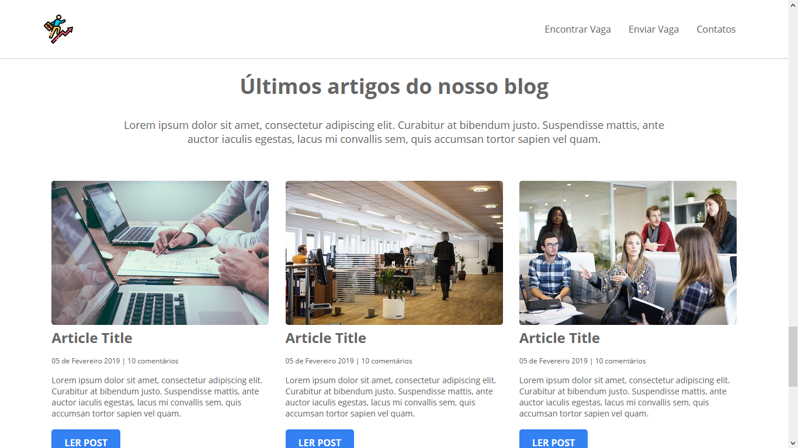

# JobFinder
A project to practice and improve knowledge in HTML and CSS without the use of frameworks

## About the project

Responsive website developed during the tutorial: <a href="https://www.youtube.com/playlist?list=PLnDvRpP8Bnez2LJGshXKtid2f-aUkFOqM">Curso de HTML e CSS</a> of the channel <a href="https://www.youtube.com/c/MatheusBattisti" >Matheus Battisti - Hora de Codar</a> 

<ul>
<li> access the page <a href="https://lucavini.github.io/JobFinder/">here</a> </li></ul>

  

